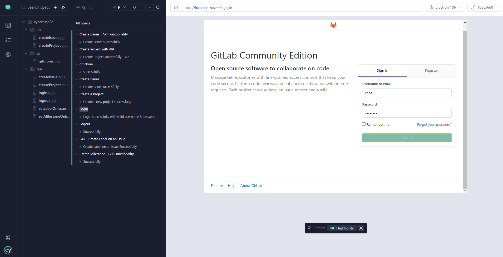
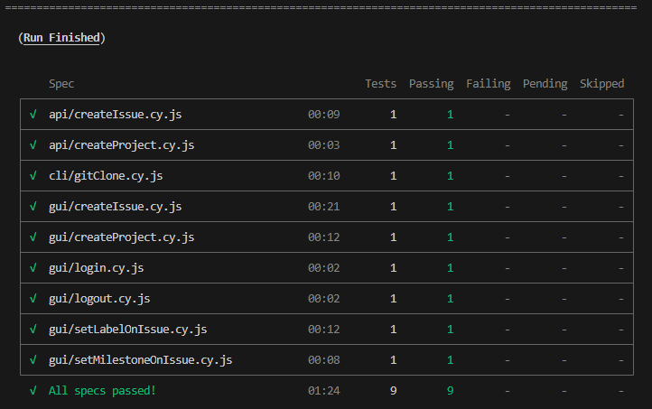

# Projeto de Testes Automatizados com Cypress - Intermediário

Este projeto foi desenvolvido como parte do curso **Testes Automatizados com Cypress - Intermediário**, oferecido pela **Escola Talking About Testing (TAT)**. Durante o curso, exploramos diversas funcionalidades e técnicas para a criação de testes automatizados.

## Objetivo do Projeto

O objetivo deste projeto é aplicar os conhecimentos adquiridos no curso, testando uma aplicação complexa. Utilizaremos uma versão open-source do GitLab, que será executada em um container no ambiente local com o auxílio do Docker.

## Tecnologias Utilizadas

Durante o desenvolvimento deste projeto, utilizamos as seguintes tecnologias:

- **Node.js**: Plataforma para execução de JavaScript no servidor.
- **Git**: Sistema de controle de versão para gerenciar o código-fonte.
- **Docker**: Ferramenta para criação e gerenciamento de containers.
- **Faker**: Biblioteca para geração de dados aleatórios.
- **Visual Studio Code (VS Code)**: Editor de código utilizado para desenvolvimento.

## Preview

## Projeto GITLAB com Docker

Nesse projeto foi explorado as seguintes fases:

- **Configuração do Ambiente Local de Desenvolvimento**:
   - preparação do ambiente com as ferramentas necessárias para desenvolver e executar testes automatizados.

- **Instalação e Configuração do Cypress**:
   - Instalação e configuração do Cypress para criar e executar os testes.

- **Testes Automatizados de Interface Gráfica de Usuário (GUI)**:
   - Realizado testes para funcionalidades como login, logout, criação de projetos e criação de issues.

- **Testes Automatizados de API com Feedback Visual no Navegador**:
   - Teste de APIs que requer um _token_ de acesso e como obter feedback visual no navegador.
- **Gerenciamento de Sessão do Usuário**:
   - Salvar e restaurar a sessão do usuário no navegador, além de validar com _token_ de acesso.

- **Limpeza e Criação da Massa de Dados**:
   - Criação de testes com pré-condições, ações e resultados esperados.

- **Proteção de Dados Sensíveis**:
   - Proteção de informações sensíveis, como senhas e tokens de acesso.

- **Organização dos Testes em Diferentes Camadas**:
   - Estruturação dos testes em camadas (API, CLI, GUI) para melhor organização.

- **Geração de Dados Aleatórios**:
   - Gerar dados aleatórios para uso nos testes automatizados.

- **Execução de Comandos à Nível de Sistema Operacional**:
    - Executar comandos diretamente no sistema operacional durante os testes.

- **Teste de Leitura de Arquivos**:
    - Testes de leitura de arquivos, incluindo o desafio de clonar um repositório Git via CLI.

## Créditos
Este projeto de testes automatizados com Cypress foi realizado como parte do curso Testes Automatizados com Cypress - BIntermediário, oferecido pela Escola Talking About Testing e ministrado por Walmyr Filho. Agradeço ao instrutor e à escola por fornecerem conhecimento valioso sobre testes automatizados.🌟

